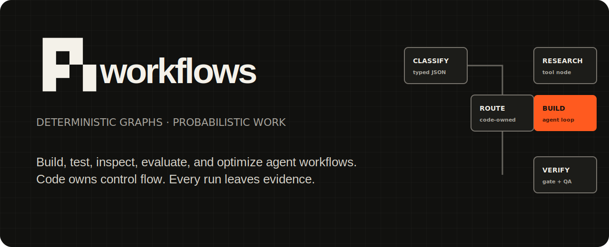

<p align="center">
  
</p>

<p align="center">
  <a href="https://github.com/ali-abassi/pi-workflows/releases"></a>
  <a href="LICENSE"></a>
</p>

# pi workflows

**Agents skip steps. pi workflows doesn't.**

A workflow harness your coding agent builds for itself. You describe the job to
Claude Code, Codex, or Pi; the agent writes a `steps.yaml` graph, picks the
model for each node, and runs it. From then on the graph owns the order, the
gates, the retries, and the budget — the model does the work but cannot quietly
skip a step, and every run leaves per-node evidence.

```bash
piw create review --action parallel-review     # agent scaffolds a valid graph
piw run review/steps.yaml --input-file task.md # code owns the order
piw detail review/steps.yaml RUN_ID --step parallel-review-verdict --io
```

> Independent community project; not an official Pi project.

## Never used Pi? Start here

`piw` orchestrates. **Pi executes the model steps** — it is the client that
talks to model providers, so you authenticate once with Pi and every workflow
inherits it. You bring your own account; pi workflows never asks for a key.

```bash
# 1. Install Pi (the model runtime)
npm install -g @earendil-works/pi-coding-agent

# 2. Authenticate the provider you already pay for
pi
/login          # pick your provider, then /exit
                # (or export an API key instead, e.g. ANTHROPIC_API_KEY)

# 3. Install pi workflows
git clone https://github.com/ali-abassi/pi-workflows.git
cd pi-workflows && ./install.sh

# 4. Confirm the whole chain is wired up
piw doctor      # run this from any directory except the clone
```

Requirements: macOS or Linux, Python 3.10+, Node.js 22+ (the extension tests use
`--experimental-strip-types`).

`pi --list-models` prints every model id your account can reach. A node pins one
of them as `provider/id`:

```yaml
model: openai-codex/gpt-5.6-luna    # whatever `pi --list-models` shows
```

**Pin a model your own account can serve.** Scaffolds default to
`openai-codex/*`; if you authenticated a different provider, pass
`--model` to `piw create` or edit the `model:` line. If the provider serves a
different model than the node pinned, the step **fails** rather than returning
another model's answer quietly.

`./install.sh` installs a copy to `~/.pi-workflows`, links `piw` into
`~/.local/bin`, links the skill for Claude Code and Codex so those agents can
author and run graphs without being told how, and — when Pi is on PATH —
registers the Pi package, which writes to `~/.pi/agent/settings.json`.
`./install.sh --uninstall` reverses all of it.

Because it installs a *copy*, `piw` from your PATH runs `~/.pi-workflows`, not
your clone. Editing the clone changes nothing until you re-run `./install.sh`.
Running `./bin/piw doctor` from inside the clone reports the package check as
failed for that reason — use `piw doctor` instead.

## Why a graph instead of just asking the agent

An agent asked to "run these five steps on 1,000 records" will improvise: skip a
step it judges unnecessary, lose track of which items finished, and report
success it cannot substantiate. Here the graph is code. The agent's judgment is
confined to the *contents* of each node.

- **Node evidence** — input, output, model, attempts, gate, QA, tokens, cost,
  latency, for every node of every run.
- **Per-node QA** — an independent judge and a bounded improve/retest loop on
  any model step.
- **Model choice per node** — cheap model to draft, expensive one to judge;
  `piw eval` compares models over one corpus with judges held fixed.
- **Cost control** — ledgers, caching, run comparison, and fail-closed batch
  token/cost ceilings.
- **Scale** — one frozen graph over 1,000 isolated inputs with resumable
  receipts and ordered output.

> Deterministic orchestration does not mean identical LLM answers. pi workflows
> pins configuration, validates output, and preserves the evidence.

## Why not LangGraph, Temporal, or n8n?

They orchestrate **code**. This orchestrates **model calls**.

- **Temporal / Prefect / Dagster** give durable execution for code you write.
  They have no concept of a per-node model, a judge, or a token ledger.
- **LangGraph / AutoGen / CrewAI** are Python libraries you write agents in.
  Here the graph is a YAML file an agent can author and validate for free —
  and be mechanically prevented from deviating from.
- **n8n / Dify** are visual builders aimed at humans wiring SaaS nodes, not at
  a coding agent authoring, inspecting, and improving a graph from a terminal.

If your steps are deterministic code, use a real orchestrator. Use this when the
steps are model calls and you need per-node cost, QA, and proof of what ran.

## At scale: one graph, 1,000 items

```bash
piw batch steps.yaml --inputs corpus.jsonl --limit 5 --require-all   # canary
piw batch steps.yaml --inputs corpus.jsonl --parallel 16 \
  --require-all --stop-after-failures 3 \
  --max-tokens 2000000 --max-cost 25 --detach --json
```

Every item gets its own input, attempt directory, event stream, artifacts, gate
results, ledger, and receipt. The manifest pins SHA-256 digests of the workflow
and the corpus; `--resume` fails closed if either changed.

## Documentation

| Guide | What it covers |
|---|---|
| [`docs/workflow-format.md`](docs/workflow-format.md) | Every `steps.yaml` field |
| [`docs/node-system.md`](docs/node-system.md) | Node kinds, gates, routing, QA |
| [`docs/actions.md`](docs/actions.md) | Reusable action templates |
| [`docs/integration-contract.md`](docs/integration-contract.md) | How agent harnesses and schedulers plug in |
| [`examples/`](examples/) | Runnable workflows, simplest first |
| [`SKILL.md`](SKILL.md) | Instructions for an agent using the product |
| [`AGENTS.md`](AGENTS.md) | Instructions for working inside this repo |

### Configuration

| Variable | Effect |
|---|---|
| `PI_WORKFLOWS_ROOTS` | `PATH`-style list of directories to discover workflows in |
| `PI_WORKFLOWS_HOME` | Install location (default `~/.pi-workflows`) |
| `PI_WORKFLOWS_BIN_DIR` | Where `piw` is linked (default `~/.local/bin`) |
| `PI_WORKFLOWS_PYTHON` | Interpreter `bin/piw` runs |
| `PI_WORKFLOWS_MODEL` · `PI_WORKFLOWS_QA_MODEL` | Defaults used by `piw create` |

Workflows are discovered under the current project and the installed examples.
Point `PI_WORKFLOWS_ROOTS` at your own directory to keep graphs elsewhere.

`piw --help` lists every command; `piw schema --json` prints the full authoring
contract. The optional local Studio (`piw ui`) is a graph runner and flight
recorder over the same `steps.yaml`.

## Develop

```bash
python3 -m venv .venv && .venv/bin/python -m pip install -r requirements.txt
npm ci --ignore-scripts
npm run verify        # or ./scripts/check.sh
```

`verify` is the full gate: unit and extension tests, typecheck, every example
validated, a live end-to-end run, and regression guards for bugs that have
shipped before. Run it before opening a pull request.

pi workflows executes shell commands and model calls with your permissions.
Review third-party workflows before running them; see [`SECURITY.md`](SECURITY.md).

## License

[MIT](LICENSE) · Contributions welcome — see [`CONTRIBUTING.md`](CONTRIBUTING.md)
and [`CHANGELOG.md`](CHANGELOG.md).
