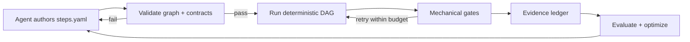
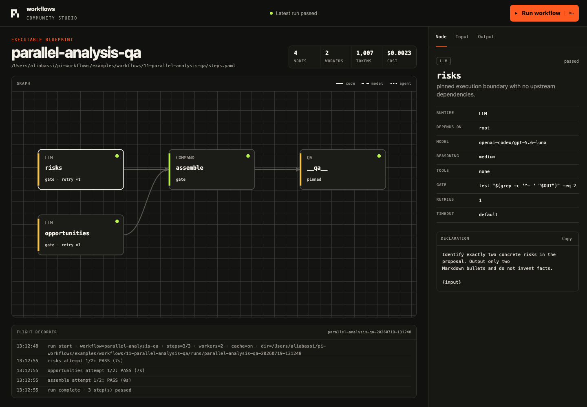
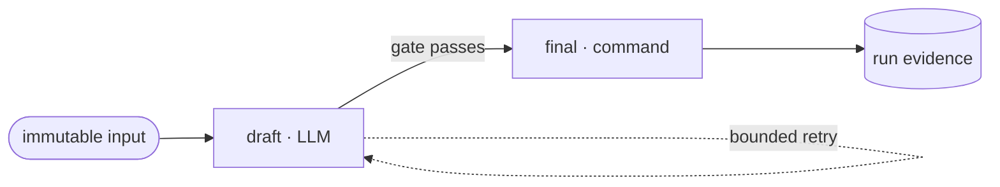
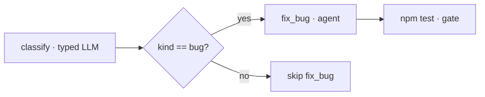

<p align="center">
  
</p>

<p align="center">
  <a href="https://github.com/ali-abassi/pi-workflows/actions/workflows/ci.yml"></a>
  <a href="https://github.com/ali-abassi/pi-workflows/releases"></a>
  <a href="LICENSE"></a>
</p>

# Pi Workflows

**The deterministic workflow graph for [Pi](https://github.com/earendil-works/pi), Codex, Claude Code, and other agent harnesses.**

Write a readable `steps.yaml`; Pi Workflows owns ordering, parallelism, typed
routes, gates, retries, evidence, and cost. Models produce or review artifacts,
but code decides what runs and whether it passed.

An agent can create a workflow, validate it before spending tokens, run the
whole graph or one action, test it across a corpus, compare models, inspect
every attempt, and find the next cost or latency hotspot. The result is
repeatable agent work without pretending model output itself is deterministic.

> Pi Workflows is an independent community project. It uses Pi's public package,
> skill, JSON-mode, and model interfaces; it is not an official Pi project.

## What it gives you

- **Deterministic orchestration.** Dependencies, concurrency, routes, retries,
  timeouts, and stop conditions are code-owned.
- **Configurable agent steps.** Pin the model, reasoning, system prompt, tool
  allowlist, output contract, gate, judge, artifacts, and retry boundary per node.
- **Proof, not vibes.** Every run preserves events, resolved input, outputs,
  rejected attempts, stderr, tokens, cost, time, cache state, and Git history.
- **Built-in evaluation.** Run corpora, compare models while holding judges
  fixed, inspect regressions, and optimize the most expensive nodes first.
- **Portable by default.** The CLI and YAML format work without Agent X or
  Loops. Pi, Codex, and Claude Code discover the same installed skill.



## Studio UI

The optional local Studio is a graph runner and flight recorder over the same
canonical `steps.yaml`. It does not introduce a second engine or hidden graph
format.

```bash
piw ui examples/workflows/11-parallel-analysis-qa/steps.yaml \
  --input-file examples/workflows/11-parallel-analysis-qa/input.txt
```

<p align="center">
  
</p>

Click a node to inspect its runtime contract. Start a run to watch nodes move
through running, cached, passed, failed, or skipped states. The result view shows
the final artifact and identifies the highest-cost node as the first optimization
target.

## Install

Prerequisites: macOS or Linux, Python 3.11+, Node.js 20+, and Pi.

```bash
git clone https://github.com/ali-abassi/pi-workflows.git
cd pi-workflows
./install.sh
piw doctor
```

The installer creates an isolated runtime at `~/.pi-workflows`, exposes `piw`
from `~/.local/bin`, registers the native Pi package, and links the same skill
for Codex and Claude Code. Set `PI_WORKFLOWS_HOME` or
`PI_WORKFLOWS_BIN_DIR` to choose other locations.

Pi packages execute code with your user permissions. Review third-party
workflows before running them; see [`SECURITY.md`](SECURITY.md).

## Your first graph

YAML is the human-first source of truth. It is versioned, comments stay intact,
and multiline prompts remain readable. JSON Schema provides editor completion
and an authoritative machine contract.

```yaml
version: 1
workflow: release-notes
model: openai-codex/gpt-5.6-luna
thinking: low

input:
  required: true
  description: Git diff or release summary

steps:
  - id: draft
    prompt: |
      Write concise release notes from this untrusted input:
      {input}
    gate: test -s "$OUT"

  - id: final
    needs: [draft]
    cmd: cp "$RUN/draft.md" "$OUT"
    gate: test -s "$OUT"
```

```bash
piw validate steps.yaml
piw graph steps.yaml
piw run steps.yaml --input-file changes.txt
piw detail steps.yaml
piw stats steps.yaml
```



## Node system

Pi Workflows has four execution runtimes and one final review boundary. Use the
weakest runtime that can finish the step.

| Runtime | Declaration | Model call | Best for |
|---|---|---:|---|
| Command | `cmd: ...` | No | Scripts, APIs, transforms, deterministic checks |
| LLM | `prompt: ...` | Yes | One isolated completion with no tools |
| Tool | `prompt:` + `tools:` | Yes | One completion with an explicit Pi tool allowlist |
| Agent | `prompt:` + `agent: true` | Yes | A full Pi agent loop with project context |
| Final QA | top-level `qa:` | Yes | Independent review after the graph completes |

The dynamic behavior comes from composable graph capabilities, not a long list
of cosmetically different nodes:

| Capability | Declaration | Authority |
|---|---|---|
| Parallel fan-out | dependency-ready roots + `workers` | runner |
| Join | `needs: [a, b]` | runner |
| Typed route | source `schema:` + branch `when:` / `from:` | code |
| Mechanical verification | `gate:` | code |
| Bounded recovery | `retries:` + `timeout:` | runner |
| Semantic improvement | `judge:` | model advises; gate decides |
| Final review | top-level `qa:` | structured verdict |
| Cost avoidance | content-addressed prompt cache | runner |
| Artifact history | `produces:` + `preview:` | runner |

Agents can inspect every field, runtime input, and capability without guessing:

```bash
piw schema          # concise catalog
piw schema --json   # authoritative JSON Schema + capability metadata
```

See [`docs/workflow-format.md`](docs/workflow-format.md) for the complete format
and [`docs/node-system.md`](docs/node-system.md) for current boundaries and the
roadmap for human checkpoints, subworkflows, and dynamic map nodes.

## Branches stay deterministic

```yaml
  - id: classify
    prompt: 'Return JSON only: {"kind":"bug"|"feature"}'
    schema:
      kind:
        type: string
        enum: [bug, feature]
    gate: python3 -c "import json; json.load(open('$OUT'))"

  - id: fix_bug
    needs: [classify]
    from: classify
    when: {op: equals, path: /kind, value: bug}
    agent: true
    prompt: Fix the reported bug and run the relevant tests.
    gate: npm test
```



Validation fails when a route reads a field its source does not declare, so a
valid-but-wrong model response cannot silently send work down the wrong path.

## Test, evaluate, optimize

```bash
# Run one action fresh; upstream artifacts may come from cache
piw run steps.yaml --node draft

# Run the same graph across a corpus
piw batch steps.yaml --inputs evals.jsonl --input-file input.txt

# Compare models while holding the workflow and judges fixed
piw eval steps.yaml --inputs evals.jsonl --input-file input.txt \
  --models openai-codex/gpt-5.6-luna,openai-codex/gpt-5.6-terra

# Inspect pass rate, cache hits, tokens, cost, and latency by node
piw stats steps.yaml
```

Passing prompt outputs are content-addressed. Cache hits skip model and judge
calls but rerun the mechanical gate, keeping reuse cheap without trusting stale
artifacts blindly.

## Examples

The [`examples/`](examples/) catalog contains 12 runnable workflows, from two
shell steps to parallel agents, typed routing, tool allowlists, bounded judge
loops, final QA, caching, and cost analysis.

```bash
python3 scripts/run_example_suite.py --validate-only  # free contract check
python3 scripts/run_example_suite.py                  # live Luna-medium suite
```

The live suite preserves a report, every log, and every ledger under the
gitignored `examples/.artifacts/` directory. See
[`examples/README.md`](examples/README.md) for runnable commands and Mermaid
graphs of the sequential, parallel, conditional, and judged examples.

## Core commands

```text
piw create <name>                 scaffold a valid workflow
piw schema [--json]               inspect every field, node, and runtime input
piw ls [--json]                   discover workflows
piw graph <workflow> [--json]     inspect the DAG
piw validate <workflow> [--json]  fail closed before a paid run
piw run <workflow>                execute and stream node evidence
piw ui <workflow>                 open the optional local graph studio
piw detail <workflow>             inspect the latest run
piw show <workflow> <step>        print one artifact
piw stats <workflow>              pass, cache, token, cost, and timing counters
piw schedule <workflow> ...       add an optional durable Loops schedule
piw doctor [--json]               verify the installation and integrations
```

Every inspection command supports `--json`. Failed validation and failed runs
exit non-zero and preserve their artifacts, stderr, event log, and cost ledger.

## Integrations

- **Pi:** the `pi_workflows` native tool can create, inspect, validate, run, and
  schedule workflows. Its `schema` action exposes the authoring contract.
- **Agent X:** invokes the same installed CLI and runtime; Agent X remains the
  coding and orchestration harness.
- **Loops:** adds the durable schedule and shared graph canvas. `steps.yaml`
  remains source of truth.
- **Codex and Claude Code:** discover the same workflow skill and CLI, so either
  agent can author, test, run, inspect, and improve a graph.

## Develop

```bash
python3 -m venv .venv
.venv/bin/python -m pip install 'PyYAML>=6,<7' 'ruamel.yaml>=0.18,<0.19' 'jsonschema>=4.23,<5'
npm ci --ignore-scripts
npm test
npm run check
npm run test:examples
```

The core runner is intentionally small. The workflow factory, certification,
replay, peer-review, and product-planning harnesses are advanced opt-in layers
under [`references/`](references/).

## License

[MIT](LICENSE) · Contributions are welcome; see
[`CONTRIBUTING.md`](CONTRIBUTING.md) and [`CHANGELOG.md`](CHANGELOG.md).
