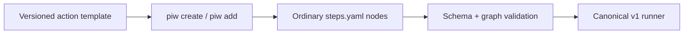

# Reusable actions

Reusable actions are versioned YAML fragments that expand into ordinary v1
steps. They are authoring shortcuts, not hidden node types: after expansion the
workflow contains only `cmd`, `prompt`, `agent`, `needs`, `schema`, `gate`,
`judge`, and retry fields that `piw schema` already documents.

```bash
piw actions                         # compact catalog
piw actions parallel-review         # contract + exact YAML
piw create review --action parallel-review
piw add review/steps.yaml extract-action-items \
  --id extract --needs parallel-review-verdict
piw validate review/steps.yaml
```



`--id` becomes the node id for a one-node action and the prefix for a multi-node
action. `--needs a,b` attaches every root in the fragment to those existing
steps and renders their artifacts into the template's labelled source block.
Internal dependencies and `{step.local-id}` references are rewritten to the
new prefixed ids. Collisions, unknown dependencies, unresolved placeholders,
schema violations, and invalid graph order fail before the file is changed.

## Included catalog

| Action | Nodes | Contract |
|---|---:|---|
| `canonicalize-jsonl` | 1 | Validate every record and emit stable compact key-sorted JSONL |
| `classify-work` | 1 | Typed `routine`, `reasoning`, or `effectful` routing decision |
| `extract-action-items` | 1 | Typed summary, actions, and risks from untrusted prose |
| `judge-and-refine` | 1 | Mechanically gated artifact with at most three scored candidates |
| `parallel-review` | 3 | Correctness and failure-mode reviews in parallel, then typed verdict |
| `evidence-synthesis` | 3 | Claim and skeptic lanes, then evidence/counterevidence decision memo |
| `repo-change` | 3 | Typed plan, scoped Pi implementation, and Git diff verification |
| `exact-item-pipeline` | 5 | Exact normalize/enrich/score/verify/emit contract for bulk runs |

The catalog is intentionally small. A repeated sequence should become an
action when its input, output, failure, and evidence contracts are stable. New
runtime semantics belong in the schema only when recovery, cancellation,
identity, and replay behavior can be mechanically enforced.

## Adding a catalog action

Add one file under `actions/` with metadata and a non-empty `steps` list. Use
`{{source}}` for immutable input or `--needs` artifacts, `{{prefix}}` when a
command needs its instantiated node prefix, and normal `{step.local-id}`
references for dependencies inside a multi-node fragment. Every public action
must pass the catalog expansion test and validate as a standalone workflow.
