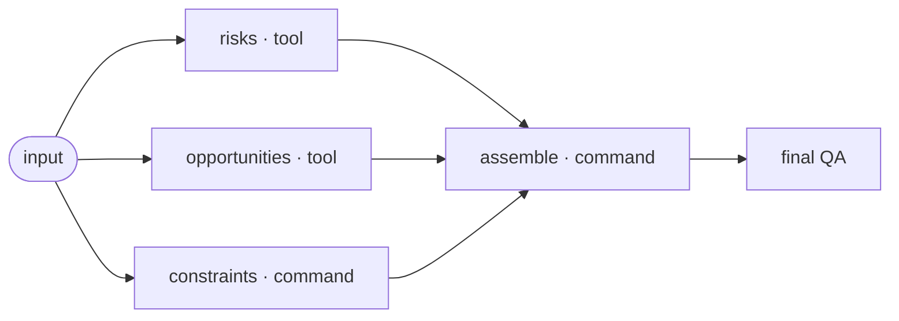
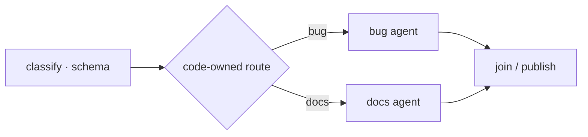
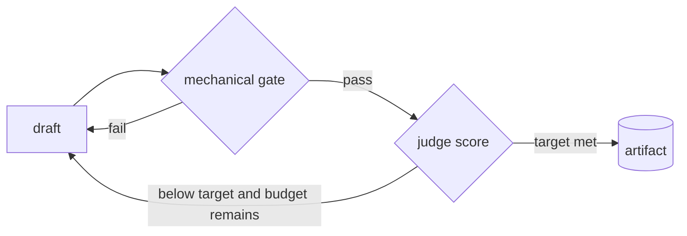

# Node system

Pi Workflows keeps the execution vocabulary deliberately small. A node names
how work executes; fields around it compose control flow, verification,
recovery, and evidence. This avoids an ecosystem of differently named nodes
that all hide the same model call.

## Execution runtimes

| Runtime | Trigger | Context | Tools | Determinism boundary |
|---|---|---|---|---|
| Command | `cmd` | workflow cwd + run environment | operating system | fixed code path |
| LLM | `prompt` | isolated rendered prompt | none | pinned model call |
| Tool | `prompt` + `tools` | isolated rendered prompt | explicit Pi allowlist | pinned model and tools |
| Agent | `prompt` + `agent: true` | Pi project context | Pi default tool loop | open agent loop |
| Final QA | top-level `qa` | all completed artifacts | optional allowlist | pinned structured review |

`tools:` is a Pi tool-selection boundary, not an operating-system sandbox.
`agent: true` runs a normal Pi agent loop. Both inherit the permissions of the
process that launched Pi Workflows.

## Composable capabilities

These capabilities are already enforced by the v1 runner and exposed through
`piw schema --json`.

| Capability | Contract | Failure behavior |
|---|---|---|
| Fan-out | dependency-ready nodes + `workers` | each node preserves its own result |
| Join | `needs: [a, b]` | downstream never runs unless every dependency passes |
| Route | source `schema` + branch `when` / `from` | malformed source or ambiguous route fails closed |
| Gate | `gate` shell command | non-zero rejects the attempt |
| Retry | `retries` + eligible classes + bounded pacing + `timeout` | ineligible failure or exhaustion fails the node and skips descendants |
| Judge loop | `judge` | score may request revision; a gate remains mechanical authority |
| Final QA | top-level `qa` | negative or malformed verdict fails the run |
| Cache | passing prompt output | hit reruns the gate before reuse |
| Artifact capture | `produces` + `preview` | in-workspace files are copied into run history |
| Evidence | every run | failure remains inspectable with non-zero exit |

## Dynamic patterns available now

The action catalog packages proven patterns without expanding this runtime
vocabulary. `piw actions <id>` exposes inputs, outputs, failure behavior,
effect class, retry safety, idempotency expectation, and cost shape before
`piw add` materializes the action as normal YAML. An agent can then inspect,
edit, validate, and test every node. See [`actions.md`](actions.md).

### Parallel research and deterministic merge

### Typed router and branch-specific agents

### Bounded semantic improvement

## Capabilities that should become first-class next

These are product boundaries, not fictional v1 node types. Until their runtime
contracts are implemented and tested, the schema does not advertise them as
native.

| Candidate | Required contract before release | Safe v1 approach |
|---|---|---|
| Human checkpoint | durable request id, explicit approver, timeout, resume token, immutable artifact digest | An external approval adapter or a gated command |
| Subworkflow | pinned workflow path/version, input/output mapping, child run id, failure propagation, recursion limit | invoke a validated `piw run --json` from a command node |
| Dynamic map | typed collection input, per-item identity, concurrency and spend ceilings, stable fan-in order | compile a static graph with the workflow factory |
| External event wait | durable subscription id, deadline, deduplication, cancellation, replay proof | An external schedule/event adapter |
| Compensation | idempotency key, declared side effects, reverse order, retry policy, evidence | explicit command nodes with effect-specific gates |
| Native sandbox policy | filesystem, process, network, and credential capabilities enforced below Pi | run the workflow in a container or OS sandbox |

The release rule is simple: a new node enters the public schema only when its
inputs, outputs, ownership, timeout, retry, cancellation, side effects, and
evidence contract are mechanically enforceable. UI-only shapes never become
runtime semantics.

## Choosing a node

1. Use a command when code can do the work.
2. Use an isolated LLM when the output is semantic but needs no tools.
3. Add an explicit tool allowlist when the completion needs bounded context.
4. Use a full agent only when iterative tool use and project context are
   essential.
5. Add a gate for any important artifact or effect.
6. Add a judge only when semantic quality cannot be reduced to a code assertion.
7. Add final QA when the completed graph needs an independent review boundary.

This ladder keeps workflows understandable, cheaper, and easier to debug.
