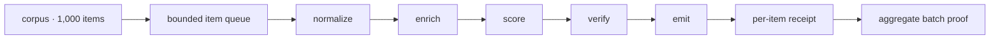
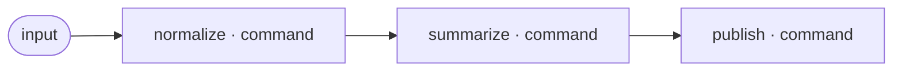
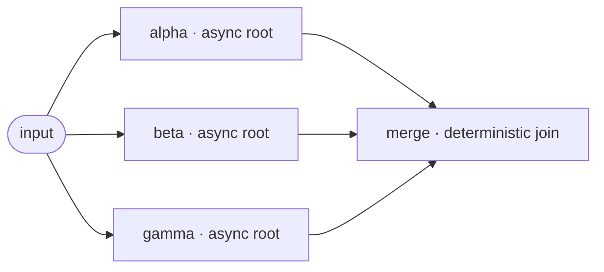
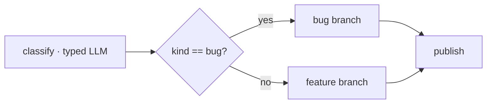
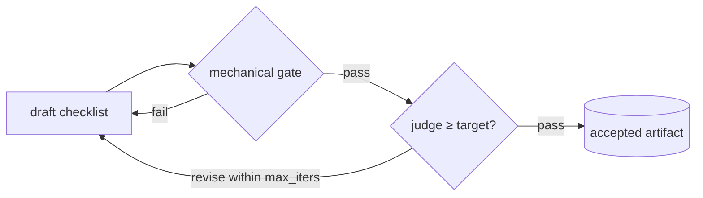
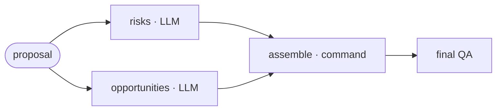
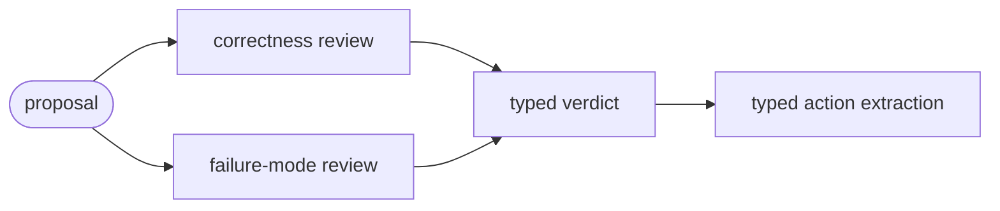

# Examples

This catalog progresses from two deterministic shell nodes to parallel Pi
agents, typed routing, tool allowlists, bounded judge loops, independent QA,
cache evidence, and optimization analysis. Every directory contains a complete
`steps.yaml` and a small `input.txt`; copy either one and edit it.

## Runnable workflows

| Example | Level | What it demonstrates |
|---|---|---|
| [`01-hello-command`](workflows/01-hello-command/) | Starter | Commands, gates, immutable input, sequential flow |
| [`02-sequential-pipeline`](workflows/02-sequential-pipeline/) | Starter | Three-stage transform and deterministic fan-in |
| [`03-parallel-fanout`](workflows/03-parallel-fanout/) | Intermediate | Three asynchronous roots and deterministic merge |
| [`04-retry-recovery`](workflows/04-retry-recovery/) | Intermediate | One intentional transient failure and bounded recovery |
| [`05-luna-summary`](workflows/05-luna-summary/) | Starter | Isolated Luna completion and output-shape gate |
| [`06-structured-extraction`](workflows/06-structured-extraction/) | Intermediate | Typed JSON output followed by code rendering |
| [`07-conditional-route`](workflows/07-conditional-route/) | Advanced | Schema-pinned classification and code-owned branching |
| [`08-tool-read`](workflows/08-tool-read/) | Advanced | Least-privilege `read` tool and source verification |
| [`09-agent-effect`](workflows/09-agent-effect/) | Advanced | Full Pi agent loop verified by its filesystem effect |
| [`10-judged-checklist`](workflows/10-judged-checklist/) | Advanced | Mechanical floor plus bounded semantic improvement |
| [`11-parallel-analysis-qa`](workflows/11-parallel-analysis-qa/) | Complex | Parallel model nodes, fan-in, and final QA |
| [`12-cache-optimization`](workflows/12-cache-optimization/) | Complex | Typed diagnosis, repeated run, cache and hotspot evidence |
| [`13-thousand-item-pipeline`](workflows/13-thousand-item-pipeline/) | Scale | Five exact steps over 1,000 isolated items with resumable evidence |
| [`14-action-template-review`](workflows/14-action-template-review/) | Complex | Two reusable actions expanded into four plain nodes with classified retries |

## Graph gallery

### 13 · 1,000 items through one five-step contract



```bash
cd examples/workflows/13-thousand-item-pipeline
python3 generate_corpus.py --count 1000
piw batch steps.yaml --inputs corpus.jsonl --parallel 16 --require-all --detach --json
```

### 02 · Sequential pipeline



### 03 · Parallel fan-out and join



### 07 · Typed conditional route



### 10 · Bounded judge loop



### 11 · Parallel model analysis with final QA



### 14 · Reusable actions remain ordinary nodes



This graph is the materialized result of `parallel-review` followed by
`extract-action-items`. The checked-in YAML contains no action indirection, so
the Studio, validator, runner, cache, and evidence ledger use the same nodes.

All model-backed example nodes—including judges and QA—are pinned to
`openai-codex/gpt-5.6-luna` at `medium` reasoning for the public live suite.
That is a cost-conscious demonstration route, not a claim that same-model QA is
independent model-diversity evidence.

## Run one

```bash
piw validate examples/workflows/05-luna-summary/steps.yaml
piw run examples/workflows/05-luna-summary/steps.yaml \
  --input-file examples/workflows/05-luna-summary/input.txt
piw detail examples/workflows/05-luna-summary/steps.yaml --io
piw stats examples/workflows/05-luna-summary/steps.yaml
```

`detail` exposes resolved input, output, attempts, rejected judge candidates,
QA, tokens, cost, and time. `stats` sorts nodes by cost so the first row is the
next optimization candidate.

## Certify the catalog

The validation pass makes no model calls:

```bash
python3 scripts/run_example_suite.py --validate-only
```

The live pass runs all 13 examples once and runs the cache example twice. The
1,000-item scale path has its own free bulk command above:

```bash
python3 scripts/run_example_suite.py
```

Evidence lands under `examples/.artifacts/` and is intentionally gitignored.
Open `report.md` for the summary and optimization findings. Every row links to
the underlying `log.md` and `ledger.json`; each copied workflow retains its run
artifacts, rejected attempts, QA report, and git history.

The accepted v0.1.1 measurements and the observability defect they exposed are
documented in [`docs/example-certification.md`](../docs/example-certification.md).

## Advanced factory blueprints

The JSON files at the root of this directory are inputs and fixtures for the
opt-in production workflow factory. They demonstrate digest-bound approvals,
conditional graphs, replay corpora, bounded peer collaboration, and the
specialized product-planning harness. Start with the runnable YAML workflows;
use the factory only when the heavier guarantees are actually required.
